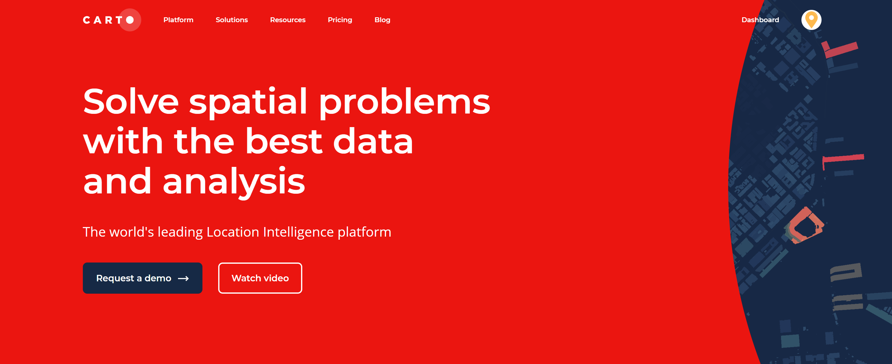

# (PART) Other {-}

# Videos

Some groups of students have contributed to the community by creating video tutorials

## CartoDB

Luis Lu and Timothy Huang  

This tutorial gives a brief overview on getting started with CartoDB, a powerful cloud computing tool that provides geospatial analysis and mapping tools. In this tutorial, we will go over the steps of getting set up on CartoDB, uploading your first dataset, creating your first map visualization, and exploring a few of Carto's provided geospatial data analysis tools.  

Link to tutorial video: [https://www.youtube.com/watch?v=GxRRXWTMMe8&feature=youtu.be](https://www.youtube.com/watch?v=GxRRXWTMMe8&feature=youtu.be)

## SandDance visualization tool

Mughilan Muthupari and Anjani Prasad Atluri

We have made a video tutorial on SandDance (a visualization tool by Microsoft), posted on YouTube [here](https://www.youtube.com/watch?v=sI4WIQEz07w){target="_blank"}.

**Note:** The presentation used can be found in the description of the video.

## Visualization: Python VS R

Nima Chitsazan and Foad Khoshouei

We created a video describing visualization in python and R. For python we specifically focused on matplotlib library and compared it to ggplot library of R. 

The video is available on youtube:
https://youtu.be/phVKWXaAStY

The slides are available:
https://github.com/fk2377/EDAVCC

